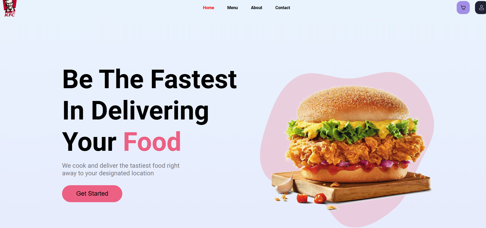
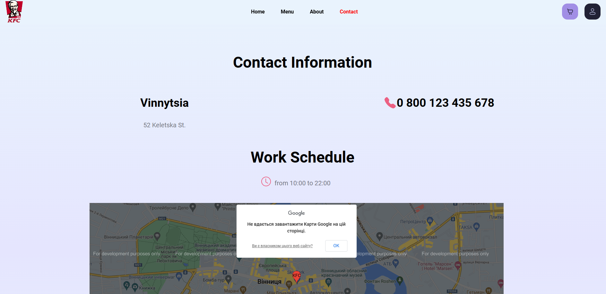

# Food App

## Project Overview

The "Food App" web application consists of three main pages: "Home", "Menu", and "Contact". Each of these pages has unique functionalities that allow users to easily order food. The app menu with a cart and login button is always accessible at the top.

## Features

### Home Page

- **Company Slogan**: Users can see the company's motto.
- **Main Ideas**: Key ideas of the company are displayed as the user scrolls down.
- **Menu Preview**: A brief representation of the menu with photos of dishes, their names, and short descriptions. This allows users to quickly get an overview and immediately add dishes to the cart.
- **Cart**: Stores all added dishes and shows their total cost.

### Menu Page

- **Full Menu**: Displays the complete menu of dishes where users can view photos, names, descriptions, prices, and add them to the cart.

### Screenshots

### Contact Page

- **Contact Information**: Provides users with contact details, operating hours, and restaurant location on Google Maps for any questions or assistance.

### Contributing

Contributions are welcome! If you'd like to improve the app or fix any issues, feel free to submit a pull request.

### Contact

For any questions or feedback, reach out to me via email: i.i.shemeta@gmail.com.
